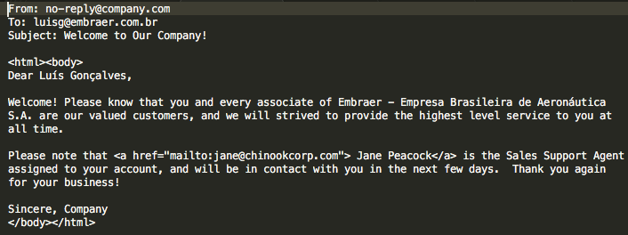
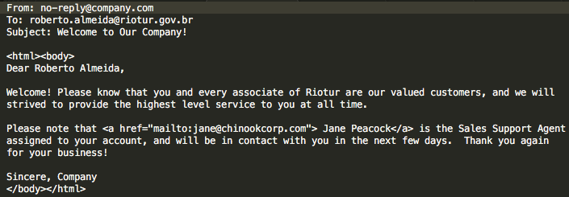
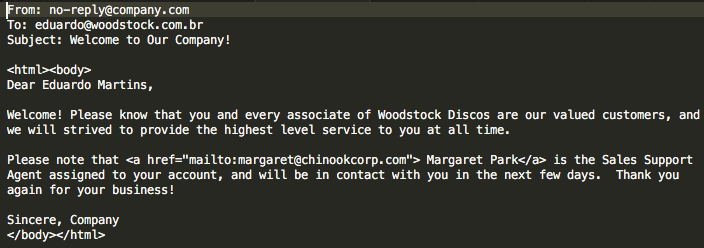

# Database Automation
 &nbsp;&nbsp;&nbsp;[« Back to Previous Section](Database-Automation.md)

## Section 2: Dynamic SQL / incorporate data variable

Inborn within Nexial is the flexibility to dynamically construct "things" - more specifically, test 
data.  We will have a separate tutorial dedicated to that topic.  For now, we want to explore the 
possibility of constructing SQL query dynamically so that:
- our automation can react accordingly to external controls
- our automation can be reusable - like a template - towards similar scenarios
- one automation can integrate with other another automation script by utilizing the same
data variables

Let's see some examples.

#### Example 1: Parameterizing SQL
We'll start with a simple example.   With Nexial, we can construct a SQL statement with dynamic 
data fairly effortlessly.  In essense, we can use the `${...}` syntax to substitute a variable 
with its value.  For example,

| variable name | value                        |
| ------------- | ---------------------------- |
| first name    | John                         |
| last name     | Denver                       |
| full name     | `${first name} ${last name}` |

As such, and as one would expect, `${full name}` would resolve to `John Denver`.

Here's our example in action.  The [data file](../artifact/data/rdbms-02.data.xlsx) contains 2
data sheets:

| data sheet    |  content                                            |
| :------------ | :-------------------------------------------------- |
| [#default]    |                    |
| [DynamicSQL1] |  |

The `supporting customer SQL` is otherwise a normal SQL, except with the use of `${...}`.  This
allows for the inclusion of dynamic data.  The said query would render as follows:

```
SELECT
	C.COMPANY                        AS CUSTOMER_COMPANY,
	C.FIRSTNAME || ' ' || C.LASTNAME AS CUSTOMER_NAME,
	C.EMAIL                          AS CUSTOMER_EMAIL,
	E.TITLE                          AS REP_TITLE,
	E.FIRSTNAME || ' ' || E.LASTNAME AS REP_NAME,
	E.EMAIL                          AS REP_EMAIL
FROM customers C, employees E
WHERE
	C.SUPPORTREPID = E.EMPLOYEEID AND
	C.COUNTRY = 'Brazil'
ORDER BY REP_NAME, CUSTOMER_NAME;
```

So now, if we would to change `customer country` to another value, like `Germany`, then the SQL
would render dynamically to the new value.

Notice that Nexial will automatically trim away the trailing semi-colon as well.  This is a
convenience in case you are copying a query from your favourite database editor or from another 
SQL file.

Our [script](../artifact/data/rdbms-02.data.xlsx) contains a query execution and a series of 
assertions:


First we execute the query represented by `${supporting customer SQL}`.  Then a series of 
assertion on the query result:
1. Make sure exactly 5 rows are returned
2. Make sure that `Jane Peacock`, `Steven Johnson` and `Margaret Park` are all supporting 
representatives for the Brazil customers.

Before executing the script, let's see what this query would render:


So if everything goes as plan, our script would return 100% PASS.  Let's run it:

```
nexial.[sh|cmd] -script <PROJECT_HOME>/artifact/script/rdbms-02.xlsx -scenario DynamicSQL1
```

The output confirms the expected outcome:


We can apply this simple technique across multiple variables and we can use the same variable
over multiple queries.

As an idea of what one can do with dynamic SQL, here's a slight modification to the same example:


Instead of asserting query result, we can loop through the resultset to dynamically generate 
external content.  In this case, we are generating what would have been a customer-specific 
marketing email content.  By using `base|repeatUntil(steps,maxWaitMs)` command we can loop
through a series of commands, such as generating email content for each row of the resultset. The
resulting output looks something like this:


The respective email content are as follows:





#### Example 2: Just-in-time WHERE clause construction

#### Example 3: Dynamic SELECT clause 

There's a much more powerful way to generate dynamic SQL using Nexial Expression.  We will cover 
this in a later tutorial.

---

Up next: [SELECT to inspect](Database-Automation-selectinspect.md)

