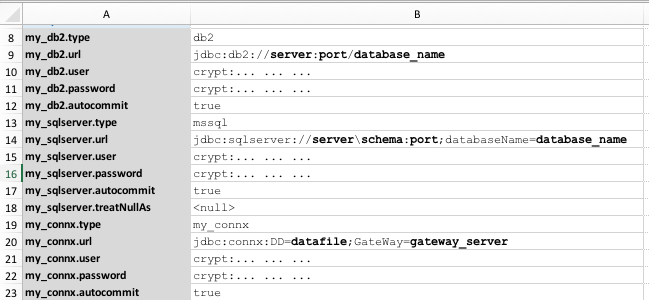

# Database Automation


## Introduction
Just to be clear: automation may or may not be related to testing.  Certainly test automation is 
greatly desired due to its myriad of benefits.  But automation can include tasks that provides no 
intrinsic value towards product quality or test coverage.  Depending on how the script is set up, 
Nexial can be used for just _automation_ or for test automation.

Nexial provides a set of capabilities that interact with target database to extract, manipulate and 
validate its data.  Speaking of database, we are referring only to RDBMS.  Support for other types 
of database will be discussed separately.

## Section 1: Setup
First thing we need to do is to set up a _profile_ for each database connectivity we need.  
Essentially profile is how one sets up database connectivity in Nexial.  To do 
that, we would add connection details in data file, like this:



Here, we have 3 distinct database profiles specified:
- `qapay01`
- `ngpdb`
- `isam`

You can differentiate them by how these profile names are used as prefix to a set of data variables.  
This is the approach in Sentry to create complex data grouping, where an arbitrary "prefix" groups
a series of configuration together.  In this case, a database connection profile consists a set of 
data variables with the same 'prefix':

```
<PROFILE>.type       = postgresql|mysql|sqlserver|oracle|db2|isam|connx
<PROFILE>.url        = jdbc:... ...
<PROFILE>.user       = ...
<PROFILE>.password   = ...
<PROFILE>.automcommit= ...
<PROFILE>.treatNullAs= ...
```

Check out [rdbms](https://confluence.ep.com/display/QA/rdbms) for more details.  

Note the following:
1. Only `.type`, `.url`, `.user`, and `.password` are **REQUIRED**.
1. `.url` should represent the JDBC connection string specific to each database vendor.  Please 
check vendor documentation for more details.
1. As of now, `connx` and `isam` are synonymous. The underlying JDBC connectivity to "isam" is 
implemented through the [Connx JDBC driver](https://www.connx.com/databases.php), which is a 
JDBC Type 3 driver. If you wish to connect to ISAM database, please obtain JDBC driver from Connx 
and place it under `/lib` directory.  We might support other ISAM JDBC drivers in the future.
1. You can create as many profiles as needed, but make sure the profile names are unique and 
contains no dot (`.`).
1. As a convinience, it might be best to put all these profiles in the `#default` data sheet so
that they can reuse for any test scenario.

Let's do a quick to verify that the profile is set up correctly.  Here's the script that we will
run, which simply runs a query to retrieve server's current time:


The corresponding data file looks as follows:


Here's the output:


We can see from the output that the SQL executed successfully (using profile `my_db2`).  Looking at
the output, we can see that the database connection is established, and the `${tell time}` query
executed successfully.  The `base|verbose(text)` command simply prints out the textual representation
of the `${my_db2 result}`. The last line in the output - `data        =[{1=2018-01-19 17:15:54.09715}]` 
is the resultset of this query.

***

Up next: [Dynamic SQL / incorporate data variable](Database-Automation-dynamicsql.md)
