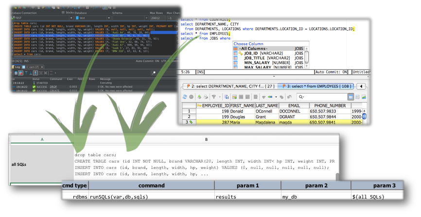
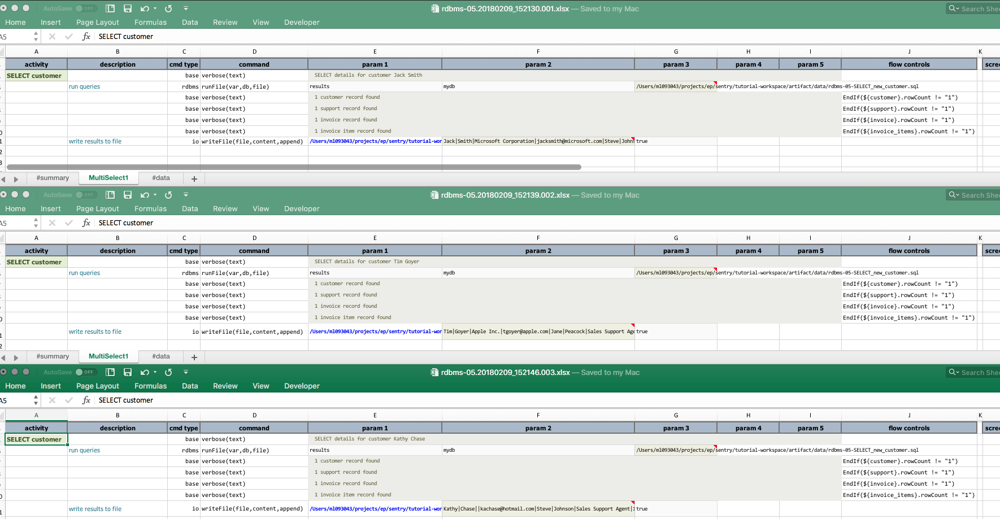
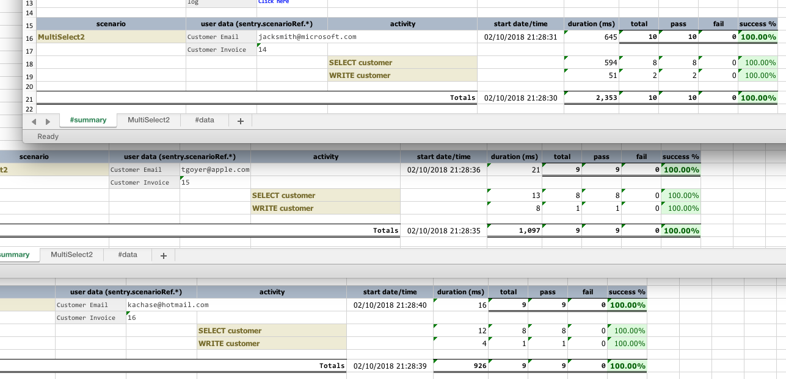

# Database Automation


<div class="site-links site-links-header">
<a class="link-previous" href="selectcsv.html">&laquo; SELECT to CSV / bulk comparions</a> | 
<a class="link-next" href="update.html">UPDATE database &raquo;</a>
</div>


## Section 6: Multiple SQLs


## SELECT one, SELECT all
Nexial supports both the execution of a single SQL or multiple SQL statements. We've already seen 
in action the `rdbms|runSQL(var,db,sql)` command.  There's also the 
<code>rdbms|runSQL**s**(var,db,**sqls**)</code> command:<br/>


The parameter `sqls` would be a multiple lines of SQL statements separated by semi-colon (`;`), 
just as the convention for most database tools.  In order for one to distinguish the result of
different SQL execution, one would _annotate_ each of the SQL statement with a SQL comment in the
form of `-- nexial:[VARIABLE]`, like this:
```sql
-- nexial:VAR1
SELECT ... ...

-- nexial:VAR2
INSERT INTO ... ...

-- more comments here, but this line is ignored by Nexial
-- however, the "Nexial" comment must be immediately preceeding the SQL statement
-- nexial:VAR3
call SP_... ...
```

After the execution of `runSQLs()` command, one could directly reference the variables referenced
in the SQL statements above, like so:<br/>


One obvious convenience with this is the fluidity of using the SQL statements developed on a
database tool/editor directly in Nexial.  You can simply copy the SQL statements to/from your
favorite database editors and Nexial datasheet.  Since the use SQL comment (via `-- `) and 
statement terminator (via `;`) are fairly universal.  The same SQL statements can be used in the
database editors and in Nexial.<br/>


To go one step further, Nexial also supports the execution of multiple SQL statements via a file:<br/>


This command behaves the same as `rdbms|runSQLs(var,db,sqls)` in terms of multiple SQL and Nexial 
variable support, but also the benefit of completely externalizing SQL statements out of Nexial 
artifacts.  There is one other benefit (or at least a difference) with using an externalized SQL
file - late data variable evaluation.

#### Late data variable evaluation
The main idea is to evaluate the specified data variables at the last possible moment - in other word, 
just-in-time.
...
...

## Combining Results from Multiple SQL


Below shows the results of the 3 iterations. Note the last line of the output in each of the output 
file that reflects 3 separate records:<br/>


For completeness, here's the CSV file generated by the execution:<br/>


Here's a slight tangent from database automation.  When executing iterations, it is often good idea
to annotate the test output with unique, iteration-bound data to tell the iteration output apart.  
We can achieve this fairly easily via the `sentry.scenarioRef.*` data variable.  Such data variable, 
along with the `sentry.scriptRef.*` data variable, are designed for the sole purpose of annotating 
test result at the scenario and script level, respectively.  Below is an example:<br/>


By assigning the `sentry.scenarioRef.Customer Email` to `${customer}.data[0].Email`, and 
`senry.scenarioRef.Customer Invoice` to `${customer}.data[0].InvoiceId`, we now "_decorate_" the
output with such data as they are rendered within the respective iteration.  Thus the output
generated per iteration would be different and could be identified as such.  See the output files
below:<br/>



***

<div class="site-links site-links-header">
<a class="link-previous" href="selectcsv.html">&laquo; SELECT to CSV / bulk comparions</a> | 
<a class="link-next" href="update.html">UPDATE database &raquo;</a>
</div>
