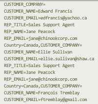

# Database Automation

<a class="link-previous" href="selectinspect.html">&laquo; SELECT to inspect</a> | 
<a class="link-next" href="selectcsv.html">SELECT to CSV / bulk comparison &raquo;</a>

## Section 4: SELECT to validate

Here are some ideas and examples of what one can do with the execution metadata and resultset in 
terms of validation.

## Example 1: Ran with failure?
After the query has been executed, we want to ensure that there isn't any unforseen error raised by
the target database server: 

Another variation to this would be using flow control.  For example: 

## Example 2: Running late...
After the query has been executed, we can evaluate the time spent in execution as a form of 
validation such as "*this SQL must return within 1 second*": 

For immediate failure and termination of current execution, be sure to set `nexial.failFast` as 
`true`.

## Example 3: Verify data "dimension"
We can also verify the "dimension" of the resultset - namely number of rows and number of columns.
This would give us a quick (albeit inexact) way to ensure we are looking at the right thing. In
addition, we can also inspect/validate the column names of the resultset as a list: 

In this case, the expected columns (`${expected columns}`) would be
`CUSTOMER_COMPANY,CUSTOMER_NAME,CUSTOMER_EMAIL,REP_TITLE,REP_NAME,REP_EMAIL,Country`

## Example 4: Data, Row by Row
To validate data, we have a number of ways. First, it is important to note that while `${results}.data` 
represents the entire resultset, the its textual rendering is in the form of "name=value" pairs, 
such as: 

Now let's consider the following example: 

The example above depicts technique to validate against the entire resultset, against a row and 
against specific cell.

#### against the entire resultset
To validate that the expected data is found in the resultset, we would assert the expected in the
form of `column_name=column_value`.  The second line in the script above reflects this strategy.

#### against 1 row
Similarly, to assert against a row of data, we would apply the same strategy.  The third line in the
script above shows the same.

#### against a specific cell
To validate against a specific cell - meaning a specific column in a specific row - we can use the 
exact value of the expected against that specific cell via the `${...}.data[row_number].COLUMN_NAME`.
See the last line in the above script for example.

## Example 5: Data Column-wise
We can also validate the resultset column-by-column.  This means to extract the data of the same 
column into a list.  Nexial provides the `${...}.cells[COLUMN_NAME]` syntax to accomplish this: 

Line 2 shows the extraction of the data - as a comma-separated list - in the column `Country`. We 
can then validate this list against a known (expected) list.  In addition, we can further manipulate
this columnwise data list via Nexial Expression, such as `distinct` (to remove duplicate data) and
`ascending` (to sort the list in ascending order) and `descending` (to sort the list in descending 
order).

***

<a class="link-previous" href="selectinspect.html">&laquo; SELECT to inspect</a> | 
<a class="link-next" href="selectcsv.html">SELECT to CSV / bulk comparison &raquo;</a>

